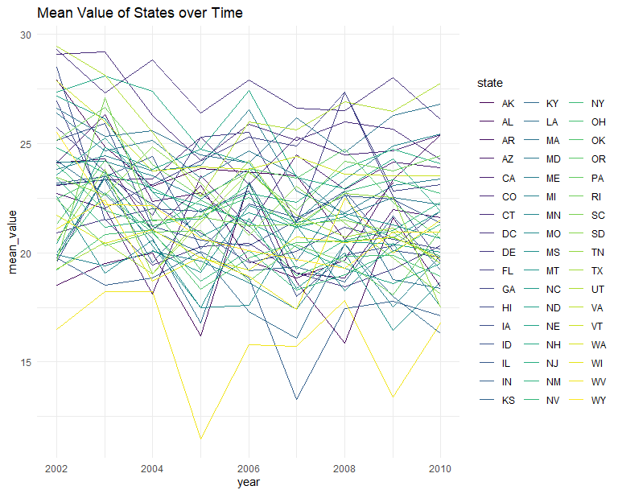
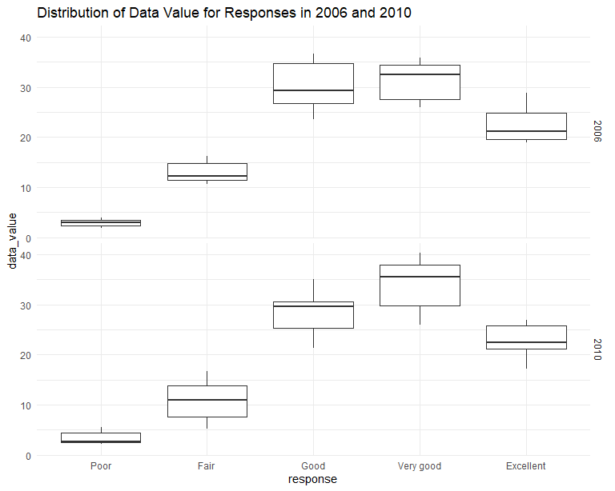
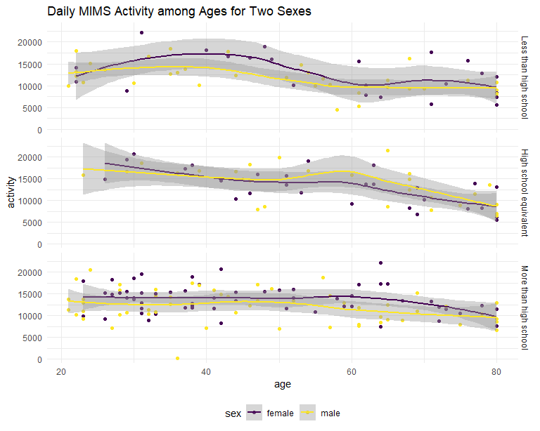
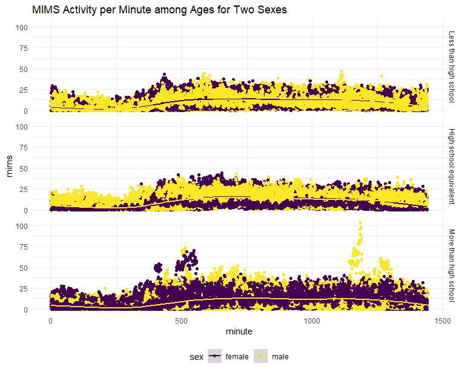

Homework 3
================
Shaolei Ma
2023-10-13

``` r
data("instacart") # import dataset

instacart = 
  instacart |> 
  as_tibble()
```

The data set `instacart` contains 1384617 observations and 15 variables
related to the information of 131209 orders of 131209 users and they all
belong to the train set. Key information includes the time of the order
(`order_dow`, `order_hour_of_day`) and the location of the product
(`aisle_id`, `aisle`, `department_id`, `department`).

- How many aisles are there, and which aisles are the most items ordered
  from?

There are 134 aisles. The number of items ordered from each aisle is
illustrated below:

| aisle                         |      n |
|:------------------------------|-------:|
| fresh vegetables              | 150609 |
| fresh fruits                  | 150473 |
| packaged vegetables fruits    |  78493 |
| yogurt                        |  55240 |
| packaged cheese               |  41699 |
| water seltzer sparkling water |  36617 |

So the top six aisles from which the most items ordered are: fresh
vegetables, fresh fruits, packaged vegetables fruits, yogurt, packaged
cheese, water seltzer sparkling water.

- Make a plot that shows the number of items ordered in each aisle,
  limiting this to aisles with more than 10000 items ordered. Arrange
  aisles sensibly, and organize your plot so others can read it.

``` r
instacart |> 
  count(aisle) |> 
  mutate(aisle = fct_reorder(aisle, n)) |>
  filter(n > 10000) |> 
  ggplot(aes(x = aisle, y = n)) +
  geom_point() + 
  labs(title = "Number of items ordered in each aisle") +
  theme(
    axis.text.x = element_text(angle = 45, hjust = 1) # rotate the x-axis labels
    )
```


- Make a table showing the three most popular items in each of the
  aisles “baking ingredients”, “dog food care”, and “packaged vegetables
  fruits”. Include the number of times each item is ordered in your
  table.

``` r
instacart |> 
  filter(aisle %in% c("baking ingredients", "dog food care", "packaged vegetables fruits")) |> 
  count(aisle, product_name, sort = T) |> 
  group_by(aisle) |> 
  top_n(3, n) |> # top 3 products within each group
  knitr::kable()
```

| aisle                      | product_name                                  |    n |
|:---------------------------|:----------------------------------------------|-----:|
| packaged vegetables fruits | Organic Baby Spinach                          | 9784 |
| packaged vegetables fruits | Organic Raspberries                           | 5546 |
| packaged vegetables fruits | Organic Blueberries                           | 4966 |
| baking ingredients         | Light Brown Sugar                             |  499 |
| baking ingredients         | Pure Baking Soda                              |  387 |
| baking ingredients         | Cane Sugar                                    |  336 |
| dog food care              | Snack Sticks Chicken & Rice Recipe Dog Treats |   30 |
| dog food care              | Organix Chicken & Brown Rice Recipe           |   28 |
| dog food care              | Small Dog Biscuits                            |   26 |

- Make a table showing the mean hour of the day at which Pink Lady
  Apples and Coffee Ice Cream are ordered on each day of the week;
  format this table for human readers (i.e. produce a 2 x 7 table).

``` r
instacart |> 
  filter(product_name %in% c("Pink Lady Apples", "Coffee Ice Cream")) |> 
  group_by(product_name,order_dow) |> 
  summarise(mean_hour = mean(order_hour_of_day)) |> 
  pivot_wider(
    names_from = order_dow,
    values_from = mean_hour
  ) |> 
  knitr::kable(digits = 2)
```

    ## `summarise()` has grouped output by 'product_name'. You can override using the
    ## `.groups` argument.

| product_name     |     0 |     1 |     2 |     3 |     4 |     5 |     6 |
|:-----------------|------:|------:|------:|------:|------:|------:|------:|
| Coffee Ice Cream | 13.77 | 14.32 | 15.38 | 15.32 | 15.22 | 12.26 | 13.83 |
| Pink Lady Apples | 13.44 | 11.36 | 11.70 | 14.25 | 11.55 | 12.78 | 11.94 |

It could be concluded that Pink Lady Apples are generally purchased
slightly earlier in the day than Coffee Ice Cream, with the exception of
day 5.

# Problem 2

First, import the `BRFSS` data set and do some data cleaning:

``` r
# import data set
data("brfss_smart2010")
brfss_smart2010 =
  brfss_smart2010 |> 
  as_tibble()

# data cleaning
problem2_df = 
  brfss_smart2010 |>
  janitor::clean_names() |> # clean names of variables
  mutate(state = locationabbr) |> # change names
  separate( # only retain the county part to remove duplicate info
    locationdesc,
    into = c("state2", "county"),
    sep = " - "
  ) |>
  select(-state2) |> 
  filter( # include only the interested topic and responses
    topic == "Overall Health", 
    response %in% c("Excellent", "Very good", "Good", "Fair", "Poor")
    ) |> 
  mutate(response = factor(response, levels = c("Poor", "Fair", "Good", "Very good", "Excellent"), ordered = T)) # order responses
```

Based on the resulting data set, a table could be made as follows
showing the states observed at 7 or more locations in 2002 and 2010:

``` r
n_location_df = 
  problem2_df |> 
  group_by(year, state) |> 
  summarise(n_locations = n_distinct(county)) |> 
  filter(n_locations >= 7, year %in% c(2002, 2010)) |> 
  arrange(year, desc(n_locations))
```

    ## `summarise()` has grouped output by 'year'. You can override using the
    ## `.groups` argument.

``` r
n_location_df |> 
  knitr::kable()
```

| year | state | n_locations |
|-----:|:------|------------:|
| 2002 | PA    |          10 |
| 2002 | MA    |           8 |
| 2002 | NJ    |           8 |
| 2002 | CT    |           7 |
| 2002 | FL    |           7 |
| 2002 | NC    |           7 |
| 2010 | FL    |          41 |
| 2010 | NJ    |          19 |
| 2010 | TX    |          16 |
| 2010 | CA    |          12 |
| 2010 | MD    |          12 |
| 2010 | NC    |          12 |
| 2010 | NE    |          10 |
| 2010 | WA    |          10 |
| 2010 | MA    |           9 |
| 2010 | NY    |           9 |
| 2010 | OH    |           8 |
| 2010 | CO    |           7 |
| 2010 | PA    |           7 |
| 2010 | SC    |           7 |

So, there are 6 states (PA, MA, NJ, CT, FL, NC) observed at 7 or more
locations in 2002, there are 14 states (FL, NJ, TX, CA, MD, NC, NE, WA,
MA, NY, OH, CO, PA, SC) observed at 7 or more locations in 2010.

Then, we construct a data set that is limited to `Excellent` responses,
and contains, year, state, and a variable `mean_value` that averages the
`data_value` across locations within a state.

``` r
excellent_df =
  problem2_df |> 
  filter(response == "Excellent") |> 
  group_by(year, state) |> 
  summarise(mean_value = mean(data_value, na.rm = T))
```

    ## `summarise()` has grouped output by 'year'. You can override using the
    ## `.groups` argument.

The resulting data set contains 443 observations and 3 variables related
to the average value of 51 states. Make a “spaghetti” plot of this
average value over time within a state.

``` r
excellent_df |> 
  ggplot(aes(x = year, y = mean_value, group = state, color = state)) + 
  geom_line() +
  theme(legend.position = "right") + 
  labs(title = "Mean Value of States over Time")
```



Finally, make a two-panel plot showing, for the years 2006, and 2010,
distribution of `data_value` for responses (“Poor” to “Excellent”) among
locations in NY State.

``` r
problem2_df |> 
  filter(year %in% c(2006, 2010), state == "NY") |> 
  ggplot(aes(x = response, y = data_value)) +
  geom_boxplot() +
  facet_grid(year ~ .) +
  labs(title = "Distribution of Data Value for Responses in 2006 and 2010")
```



It could be concluded that for counties that have value for both 2006
and 2010, the values increase over the time. “Bronx County”, “Erie
County”, and “Kings County” are the counties that only have data for
2010.

# Problem 3

Load, tidy, merge, and otherwise organize the data sets.

``` r
demographics_df =
  read_csv("data/nhanes_covar.csv", skip = 4) |> # skip the first 4 rows
  janitor::clean_names() |> 
  drop_na() |> # exclude participants with missing demographic data
  filter(age >= 21) |> #include only those 21 or more than 21 years old
  mutate( # replace numbers with meaning and order
    sex = case_match(
      sex,
      1 ~ "male",
      2 ~ "female"
    ),
    education = factor(
      case_match(
        education,
        1 ~ "Less than high school",
        2 ~ "High school equivalent",
        3 ~ "More than high school"
      ),
      labels = c("Less than high school", "High school equivalent", "More than high school"), ordered = T)
  )
```

    ## Rows: 250 Columns: 5
    ## ── Column specification ────────────────────────────────────────────────────────
    ## Delimiter: ","
    ## dbl (5): SEQN, sex, age, BMI, education
    ## 
    ## ℹ Use `spec()` to retrieve the full column specification for this data.
    ## ℹ Specify the column types or set `show_col_types = FALSE` to quiet this message.

``` r
accelerometer_df = 
  read_csv("data/nhanes_accel.csv") |> 
  janitor::clean_names() |> 
  pivot_longer(
    min1:min1440,
    names_to = "minute",
    values_to = "mims",
    names_prefix = "min"
  ) |> 
  mutate(
    minute = as.numeric(minute)
  )
```

    ## Rows: 250 Columns: 1441
    ## ── Column specification ────────────────────────────────────────────────────────
    ## Delimiter: ","
    ## dbl (1441): SEQN, min1, min2, min3, min4, min5, min6, min7, min8, min9, min1...
    ## 
    ## ℹ Use `spec()` to retrieve the full column specification for this data.
    ## ℹ Specify the column types or set `show_col_types = FALSE` to quiet this message.

``` r
result_df = 
  demographics_df |> 
  left_join(accelerometer_df)
```

    ## Joining with `by = join_by(seqn)`

So, the final dataset contains 328320 observations and 7 variables
related to 1440 minutes of MIMS value of 228 participants.

Then, produce a reader-friendly table for the number of men and women in
each education category.

``` r
demographics_df |> 
  count(education, sex) |> 
  pivot_wider(
    names_from = sex,
    values_from = n
  ) |> 
  knitr::kable()
```

| education              | female | male |
|:-----------------------|-------:|-----:|
| Less than high school  |     23 |   35 |
| High school equivalent |     28 |   27 |
| More than high school  |     59 |   56 |

So, most participants have an education background more than high
school, and female tend to have received higher education than male.

Create a visualization of the age distributions for men and women in
each education category.

``` r
demographics_df |> 
  ggplot(aes(x = education, y = age)) +
  geom_violin() +
  facet_grid(sex ~ .)
```


It could be concluded that younger people tend to receive higher
education. This trend is more obvious for female than male.

Using the tidied data set, aggregate across minutes to create a total
activity variable for each participant.

``` r
activity_df = 
  result_df |> 
  group_by(seqn, sex, age, education) |> 
  summarise(activity = sum(mims))
```

    ## `summarise()` has grouped output by 'seqn', 'sex', 'age'. You can override
    ## using the `.groups` argument.

Plot these total activities against age.

``` r
activity_df |> 
  ggplot(aes(x = age, y = activity, color = sex)) +
  geom_point() +
  geom_smooth() +
  facet_grid(education ~ .) +
  labs(title = "Daily MIMS Activity among Ages for Two Sexes")
```

    ## `geom_smooth()` using method = 'loess' and formula = 'y ~ x'



It could be concluded that:

- The activity score tends to decrease as age increases for these three
  different education levels.

- Female tends to have higher activity score than male except for the
  “High school equivalent” education level.

Finally, make a three-panel plot that shows the 24-hour activity time
courses for each education level and use color to indicate sex.

``` r
result_df |> 
  ggplot(aes(x = minute, y = mims, color = sex)) +
  geom_point() +
  geom_smooth() +
  facet_grid(education ~ .) +
  labs(title = "MIMS Activity per Minute among Ages for Two Sexes")
```

    ## `geom_smooth()` using method = 'gam' and formula = 'y ~ s(x, bs = "cs")'



It could be concluded that the MIMS scores follow the same trend across
genders, with MIMS scores increasing at around 400 minutes and
decreasing at around 1300 minutes for all levels of education.
